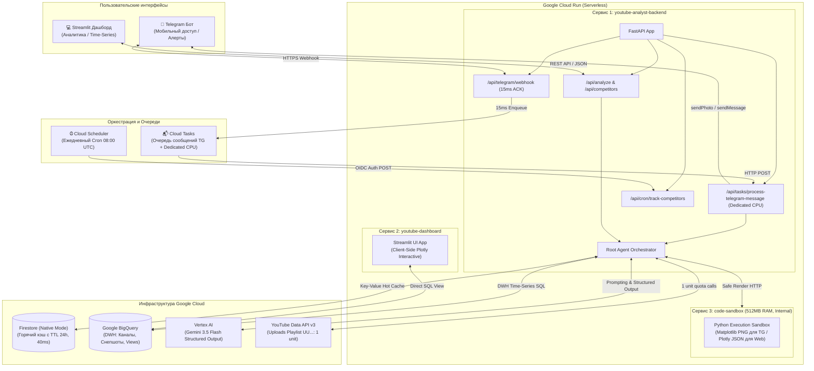

# 🎬 YouTube Analytics Platform (GCP Production v2.1)

A scalable, serverless YouTube Analytics and Competitor Monitoring Platform built on **Google Cloud Platform (GCP)** with **FastAPI**, **Gemini 3.5 Flash**, **BigQuery**, **Firestore**, **Cloud Tasks**, **Streamlit**, and an isolated **Code Sandbox**.

---

## 🏛️ Production Architecture



---

## 💎 Ключевые продакшн-стандарты

1. **Защита от CPU Throttling в Cloud Run**: Telegram-вебхук за 15 мс кладет задачу в **Google Cloud Tasks**, обеспечивая воркеру 100% выделенный CPU, автоматические ретраи и сохраняя Scale-to-Zero.
2. **Экономия квоты YouTube API на 99%**: Загрузки видео запрашиваются через плейлист `UU...` (`playlistItems().list`), тратя **1 unit** вместо 100 units.
3. **Безопасная песочница кодогенерации (`code-sandbox`)**:
   - **Для Telegram**: Генерация легкого **Matplotlib PNG** (40 мс, <50MB RAM, без Chromium).
   - **Для Streamlit**: Генерация **Plotly JSON** с нативным интерактивным рендерингом в браузере клиента.
4. **Двухуровневое хранилище**:
   - **Firestore (Native Mode, TTL 24h)**: горячий кэш с откликом 30–50 мс и автоочисткой.
   - **BigQuery DWH**: долгосрочные снепшоты, дедупликация через `MERGE` и View `v_latest_channel_stats`.

---

## 📁 Структура репозитория

```
youtube-analitics-platform/
├── backend/
│   ├── api/
│   │   └── v1/
│   │       ├── endpoints/
│   │       │   ├── analyze.py         # AI-аналитик для дашборда
│   │       │   ├── channels.py        # Эндпоинты каналов
│   │       │   ├── competitors.py     # Регистрация конкурентов в BQ
│   │       │   ├── cron.py            # 08:00 UTC ежедневный сбор метрик
│   │       │   ├── ingestion.py       # Синхронизация данных
│   │       │   ├── tasks.py           # Воркер задач Cloud Tasks
│   │       │   ├── telegram.py        # Вебхук Telegram с ACK за 15 мс
│   │       │   └── videos.py          # Видео-метрики и KPI
│   │       └── router.py
│   ├── services/
│   │   ├── agent_orchestrator.py      # Оркестратор агента
│   │   ├── bigquery_service.py        # DWH клиент и аналитика
│   │   ├── cloud_tasks_service.py     # Очереди Google Cloud Tasks
│   │   ├── firestore_cache.py         # Горячий кэш с TTL
│   │   ├── gemini_service.py          # Gemini 3.5 Flash Structured Output
│   │   ├── sandbox_client.py          # HTTP-клиент к песочнице
│   │   ├── telegram_bot.py            # Отправка фото и текста в TG
│   │   └── youtube_client.py          # YouTube API (UU... плейлисты)
│   └── main.py                        # Точка входа FastAPI
├── dashboard/
│   ├── app.py                         # Главный экран Streamlit
│   ├── pages/
│   │   ├── 1_📈_Time_Series.py        # Анализ трендов и динамики каналов
│   │   ├── 2_💬_AI_Analyst.py         # Интерактивный чат с Plotly
│   │   └── 3_⚙️_Competitors_Mgmt.py   # Реестр каналов-конкурентов
│   └── utils/
│       └── api_client.py              # HTTP-клиент к бэкенду
├── services/
│   └── sandbox/                       # Сервис 3: Изолированная песочница
│       ├── app.py                     # POST /execute, GET /warmup
│       ├── runner.py                  # Изолированный запуск с таймаутом
│       ├── Dockerfile                 # Non-root user (512MB RAM)
│       └── requirements.txt
├── sql/
│   └── ddl.sql                        # BigQuery DDL схемы и Views
├── scripts/
│   ├── deploy_all.sh                  # Деплой трех сервисов в Cloud Run
│   ├── run_dev.sh                     # Локальный запуск (бэкенд + дашборд)
│   ├── setup_dwh.py                   # Накатка DDL в BigQuery
│   └── setup_infra.sh                 # Включение API, Cloud Tasks, Firestore TTL
├── tests/
│   └── test_backend.py                # Комплексные E2E тесты
├── youtube_analitics_implementation_plan_v2.md
├── Dockerfile
├── requirements.txt
└── pyproject.toml
```

---

## 🚀 Быстрый запуск

### 1. Локальная разработка

```bash
# Активация виртуального окружения
source .venv/bin/activate
pip install -r requirements.txt
pip install -r services/sandbox/requirements.txt

# Настройка переменных окружения
cp .env.example .env

# Запуск бэкенда и Streamlit дашборда
./scripts/run_dev.sh
```

- **Дашборд**: [http://localhost:8501](http://localhost:8501)
- **API Swagger**: [http://localhost:8000/docs](http://localhost:8000/docs)
- **Песочница (при локальном запуске)**: [http://localhost:8080/docs](http://localhost:8080/docs)

### 2. Настройка инфраструктуры Google Cloud

```bash
gcloud auth application-default login
./scripts/setup_infra.sh
```

Скрипт автоматически:
1. Включает необходимые GCP API (Cloud Run, Cloud Tasks, Firestore, BigQuery, Vertex AI, Scheduler).
2. Создает очередь Cloud Tasks `telegram-tasks`.
3. Включает нативную TTL-политику для коллекции `api_cache` в Firestore.
4. Создает таблицы и View в BigQuery на основе `sql/ddl.sql`.

### 3. Деплой всех сервисов в Cloud Run

```bash
./scripts/deploy_all.sh
```

---

## 🧪 Запуск тестов

```bash
pytest tests/
```
