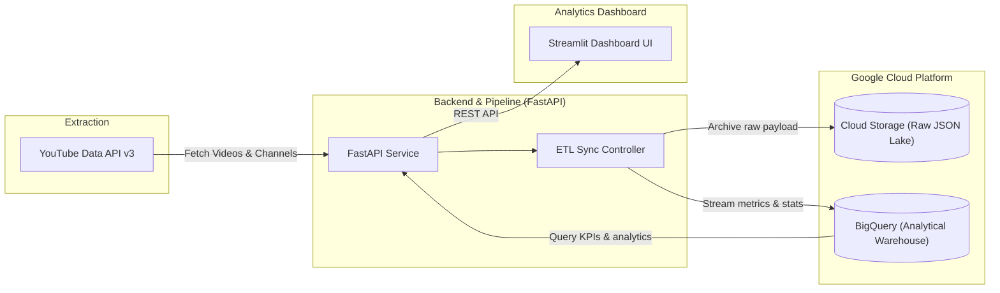

# 🎬 YouTube Analytics Platform

A scalable, full-stack YouTube Analytics and Data Ingestion platform built with **Python 3.12**, **FastAPI**, **Google Cloud Platform (BigQuery & Cloud Storage)**, and **Streamlit**.

---

## 🏛️ Architecture Overview



### Key Components
1. **Extraction**: Connects to the YouTube Data API v3 (with automatic fallback to mock generators if no API key is provided).
2. **Data Lake Storage (GCS)**: Stores raw JSON extracts partitioned by date (`channels/YYYY/MM/DD/{channel_id}_raw.json`).
3. **Data Warehouse (BigQuery)**: Stores clean, query-optimized analytical tables (`channels` and `video_metrics`).
4. **FastAPI Backend**: Provides high-performance RESTful APIs for querying analytics, metrics, KPIs, and triggering ingestion jobs.
5. **Streamlit Frontend**: Interactive UI for channel overview, video performance analysis, engagement scatter plots, and manual ingestion triggers.

---

## 📁 Repository Structure

```
youtube-analitics-platform/
├── backend/
│   ├── api/
│   │   └── v1/
│   │       ├── endpoints/
│   │       │   ├── channels.py        # Channel endpoints
│   │       │   ├── videos.py          # Video metrics & KPI endpoints
│   │       │   └── ingestion.py       # Pipeline trigger endpoint
│   │       └── router.py              # API v1 router
│   ├── models/
│   │   ├── channel.py                 # Pydantic schemas for channels
│   │   └── video.py                   # Pydantic schemas for videos
│   ├── services/
│   │   ├── bigquery_service.py        # BigQuery integration & analytical queries
│   │   ├── storage_service.py         # Google Cloud Storage raw backup service
│   │   └── youtube_client.py          # YouTube Data API v3 client & fallback
│   └── main.py                        # FastAPI application entrypoint
├── dashboard/
│   ├── app.py                         # Streamlit main dashboard & KPIs
│   ├── pages/
│   │   ├── 1_📊_Channel_Overview.py    # Channel metrics & comparison
│   │   ├── 2_🎬_Video_Performance.py   # Engagement & correlation charts
│   │   └── 3_🔄_Data_Ingestion.py     # Interactive data sync interface
│   └── utils/
│       └── api_client.py              # Dashboard HTTP client for backend
├── config/
│   ├── __init__.py
│   └── settings.py                    # Environment & Pydantic settings
├── scripts/
│   ├── run_dev.sh                     # Concurrent dev server runner
│   └── setup_bigquery.py              # BigQuery table initialization script
├── tests/
│   └── test_backend.py                # Backend unit and integration tests
├── .env.example                       # Sample environment variables
├── .gitignore
├── Dockerfile                         # Cloud Run container definition
├── pyproject.toml
└── requirements.txt
```

---

## 🚀 Quickstart Guide

### 1. Environment Setup

Create and activate your virtual environment:

```bash
python3 -m venv .venv
source .venv/bin/activate
pip install -r requirements.txt
```

### 2. Configuration

Copy `.env.example` to `.env`:

```bash
cp .env.example .env
```

Update your configuration parameters in `.env`:
- `YOUTUBE_API_KEY`: Your Google Cloud YouTube Data API v3 key (optional: if omitted, sample mock data is generated for testing).
- `GCP_PROJECT_ID`: Your Google Cloud Project ID (e.g. `agentverse-guardian-gcloud`).
- `BIGQUERY_DATASET_ID`: Target BigQuery dataset (default: `youtube_analytics`).
- `GCS_BUCKET_NAME`: Cloud Storage bucket for raw data archives.

### 3. Initialize Google Cloud Resources

Authenticate with GCP and provision the BigQuery tables:

```bash
gcloud auth application-default login
python scripts/setup_bigquery.py
```

### 4. Run the Application

You can launch both the **FastAPI Backend** and the **Streamlit Dashboard** simultaneously:

```bash
./scripts/run_dev.sh
```

Or run them in separate terminals:

```bash
# Terminal 1: FastAPI Backend
uvicorn backend.main:app --host 0.0.0.0 --port 8000 --reload

# Terminal 2: Streamlit Dashboard
streamlit run dashboard/app.py --server.port 8501
```

- **Dashboard UI**: [http://localhost:8501](http://localhost:8501)
- **API Documentation (Swagger)**: [http://localhost:8000/docs](http://localhost:8000/docs)
- **API Health Check**: [http://localhost:8000/health](http://localhost:8000/health)

---

## 🧪 Running Tests

Run the test suite with `pytest`:

```bash
pytest tests/
```

---

## ☁️ Deployment (Google Cloud Run)

Build and deploy directly to Google Cloud Run:

```bash
gcloud run deploy youtube-analytics-backend \
    --source . \
    --platform managed \
    --region us-central1 \
    --allow-unauthenticated
```
