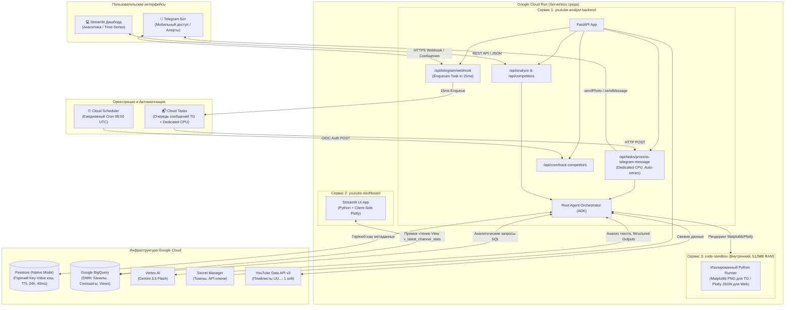
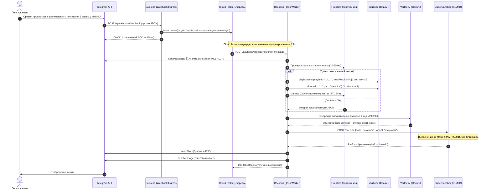
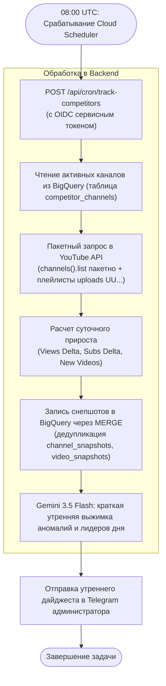

# Комплексный план и архитектурное руководство: YouTube Analytics Platform на GCP (Production v2.1)

> [!NOTE]
> В данном документе подробно описано, как устроена система, как взаимодействуют между собой компоненты и как выполняются основные бизнес-сценарии с учетом утвержденных продакшн-стандартов GCP: асинхронные очереди **Cloud Tasks**, экономия квоты YouTube API через **Uploads Playlist (UU...)**, легковесный **Matplotlib** для мобильного Telegram + интерактивный **Plotly JSON** для дашборда, а также разделение зон ответственности между быстрым **Firestore (TTL)** и аналитическим **BigQuery**.

---

## 1. Обзор системы и архитектурная концепция

Платформа представляет собой распределенную бессерверную (Serverless) аналитическую систему на базе **Google Cloud Platform**, объединяющую большие языковые модели (**Gemini 3.5 Flash**), корпоративное хранилище данных (**BigQuery**), оперативный NoSQL-кэш (**Firestore**), очереди задач (**Cloud Tasks**) и официальный **YouTube Data API v3**.

### Архитектурная диаграмма



---

## 2. Сквозные сценарии: Как всё работает на практике

### Сценарий А. Пользователь делает запрос через Telegram (Мобильный путь с Cloud Tasks)

Этот сценарий гарантирует **100% надежность выполнения** в Serverless-среде без зависаний процессора:



1. **Мгновенный ACK (15 мс)**: Сервер моментально отвечает `200 OK` Telegram, исключая дублирование запросов.
2. **Cloud Tasks гарантирует CPU**: Воркер работает в рамках полноценного входящего HTTP-запроса от Cloud Tasks, процессор выделен на 100%. При временном сбое срабатывает автоматический ретрай.
3. **Экономия квот на 99%**: Видео запрашиваются через плейлист загрузок `UU...` (1 unit квоты вместо 100).
4. **Горячий кэш Firestore (40 мс)**: Проверка кэша происходит в десятки раз быстрее BigQuery, устаревшие записи удаляются Google Cloud автоматически через нативный TTL.
5. **Быстрый и надежный рендеринг (Matplotlib)**: Генерация картинки для мобильного экрана занимает 40 мс и не требует Chromium, исключая OOM-падения.

---

### Сценарий Б. Работа с аналитическим дашбордом на Streamlit (Десктопный путь)

Дашборд предназначен для углубленного визуального анализа, изучения динамики конкурентов во времени и прямого диалога с AI-агентом.

1. **Вкладка «Мониторинг конкурентов (Time-Series)»**:
   * Пользователь открывает веб-страницу дашборда.
   * Streamlit напрямую отправляет быстрый SQL-запрос в BigQuery через оптимизированное представление:
     ```sql
     SELECT channel_title, snapshot_date, net_view_growth, net_subscriber_growth
     FROM `youtube_analytics.v_latest_channel_stats`
     WHERE snapshot_date >= DATE_SUB(CURRENT_DATE(), INTERVAL 30 DAY)
     ORDER BY snapshot_date ASC;
     ```
   * **Результат**: Графики трендов и таблицы лидеров рендерятся за сотни миллисекунд **без обращения к YouTube API и без вызовов Gemini**.
2. **Вкладка «AI-Аналитик (Интерактивный чат)»**:
   * Пользователь вводит вопрос: *«Найди видео с самым высоким ER среди всех конкурентов за месяц и объясни, почему оно взлетело»*.
   * Streamlit отправляет запрос на эндпоинт бэкенда `/api/analyze`.
   * Агент запрашивает данные из BigQuery, анализирует контекст через Gemini 3.5 Flash и генерирует спецификацию **Plotly JSON** (`fig.to_json()`).
   * Компонент `st.plotly_chart()` отрисовывает интерактивный график прямо в браузере клиента. Сервер вообще не тратит ресурсы на конвертацию графиков в картинки.
3. **Вкладка «Управление списком мониторинга»**:
   * Форма для добавления URL нового канала-конкурента. Бэкенд валидирует канал через YouTube API и регистрирует его в таблице `competitor_channels`.

---

### Сценарий В. Автоматический сбор данных по расписанию (Cloud Scheduler + Cron)

Этот процесс работает полностью автономно в фоновом режиме раз в сутки в 08:00 UTC:



1. **Таймер**: В 08:00 UTC Cloud Scheduler делает защищенный HTTP POST-запрос с Google OIDC токеном на бэкенд.
2. **Батчинг**: Статистика по всем отслеживаемым каналам собирается за 1 пакетный запрос `channels().list(id="id1,id2,id3...")` (1 unit квоты).
3. **Сохранение Time-Series с дедупликацией**: Данные вставляются через SQL `MERGE`, исключая дубли записей за одну дату.
4. **Умный дайджест**: Gemini структурированно формирует утреннюю выжимку аномалий и лидеров дня.

---

### Сценарий Г. Безопасная песочница кодогенерации (Code Sandbox, 512MB RAM)

Для полного исключения уязвимостей Remote Code Execution (RCE):

```mermaid
flowchart LR
    Agent["Backend Agent\n(Gemini сгенерировал код)"] -->|POST /execute\nJSON: {code, dataframe, format}| Sandbox["Контейнер Code Sandbox\n(Cloud Run Private Ingress, 512MB)"]
    
    subgraph SandboxInternal ["Изоляция внутри Sandbox"]
        Limits["Ограничения:\n- RAM: 512MB\n- Timeout: 5 sec\n- Non-root user\n- No Internet access"]
        Exec["Выполнение кода в чистом namespace\n(pandas, matplotlib, plotly)"]
        FormatDecision{"Формат?"}
        Limits --> Exec --> FormatDecision
        FormatDecision -->|format == 'matplotlib'| MatplotlibExport["plt.savefig(buf, format='png')\n(40ms, 40MB RAM)"]
        FormatDecision -->|format == 'plotly'| PlotlyExport["fig.to_json()\n(0ms, чисто JSON)"]
    end
    
    Sandbox --> SandboxInternal
    MatplotlibExport -->|Response JSON: {png_base64}| Agent
    PlotlyExport -->|Response JSON: {plotly_spec}| Agent
```

1. **Изоляция сети**: У сервиса `code-sandbox` отключен исходящий интернет (`VPC egress disabled`).
2. **Легковесный стек**: Для Telegram используется чистый Matplotlib (40 мс, 40MB RAM, без Chromium). Для веб-дашборда отдается `Plotly JSON`.
3. **Запас памяти**: 512MB RAM с запасом покрывает любые вычисления Pandas.

---

## 3. Схема данных BigQuery (DDL)

```sql
-- Создание датасета
CREATE SCHEMA IF NOT EXISTS `youtube_analytics`
OPTIONS (location = 'europe-west1');

-- 1. Реестр отслеживаемых каналов
CREATE TABLE IF NOT EXISTS `youtube_analytics.competitor_channels` (
    channel_id STRING NOT NULL,
    channel_title STRING NOT NULL,
    custom_url STRING,
    is_active BOOLEAN DEFAULT TRUE,
    added_at TIMESTAMP DEFAULT CURRENT_TIMESTAMP()
);

-- 2. Ежедневные снепшоты каналов (Партиционирование по дате)
CREATE TABLE IF NOT EXISTS `youtube_analytics.channel_snapshots` (
    channel_id STRING NOT NULL,
    snapshot_date DATE NOT NULL,
    subscriber_count INT64,
    total_views INT64,
    total_videos INT64,
    net_subscriber_growth INT64,
    net_view_growth INT64,
    created_at TIMESTAMP DEFAULT CURRENT_TIMESTAMP()
)
PARTITION BY snapshot_date
CLUSTER BY channel_id;

-- 3. Снепшоты видеороликов
CREATE TABLE IF NOT EXISTS `youtube_analytics.video_snapshots` (
    video_id STRING NOT NULL,
    channel_id STRING NOT NULL,
    title STRING,
    published_at TIMESTAMP,
    snapshot_timestamp TIMESTAMP NOT NULL,
    view_count INT64,
    like_count INT64,
    comment_count INT64,
    calculated_er FLOAT64
)
PARTITION BY DATE(snapshot_timestamp)
CLUSTER BY channel_id, video_id;

-- 4. Представление для мгновенного получения актуального среза по каналам
CREATE OR REPLACE VIEW `youtube_analytics.v_latest_channel_stats` AS
SELECT * EXCEPT(rn)
FROM (
    SELECT *, ROW_NUMBER() OVER (PARTITION BY channel_id ORDER BY snapshot_date DESC) as rn
    FROM `youtube_analytics.channel_snapshots`
)
WHERE rn = 1;
```

> [!NOTE]
> Таблица кэша API перенесена из BigQuery в **Google Cloud Firestore** (Native Mode) с поддержкой TTL на поле `expires_at`.

---

## 4. Пошаговый план внедрения (Work Breakdown Structure)

### Спринт 1: Инфраструктура, DWH и Очереди (1–2 день)
* [ ] Создать проект GCP, включить API: Vertex AI, Cloud Run, BigQuery, Secret Manager, Cloud Scheduler, Cloud Tasks, Firestore.
* [ ] Создать очередь в Cloud Tasks: `gcloud tasks queues create telegram-tasks --max-attempts=3`.
* [ ] Настроить Firestore в Native Mode с включенной политикой TTL для поля `expires_at`.
* [ ] Создать секреты в Secret Manager: `TELEGRAM_BOT_TOKEN`, `TELEGRAM_WEBHOOK_SECRET`, `YOUTUBE_API_KEY`.
* [ ] Развернуть таблицы и View в BigQuery по схеме DDL.

### Спринт 2: Безопасная песочница и ядро агента (2–4 день)
* [ ] Разработать микросервис `code-sandbox` на FastAPI (512MB RAM, эндпоинт `/execute` с поддержкой Matplotlib PNG и Plotly JSON).
* [ ] Собрать Docker-образ песочницы и задеплоить в Cloud Run с доступом `Internal Only`.
* [ ] Модернизировать `tools.py` в агенте:
  * Заменить `search().list` на сбор через плейлист загрузок `UU...` (`playlistItems().list`).
  * Подключить горячий кэш Firestore (TTL 24h).
  * Подключить HTTP-клиент к микросервису `code-sandbox`.
  * Реализовать Sentiment-анализ через Vertex AI Gemini 3.5 Flash с Pydantic `response_schema`.

### Спринт 3: Бэкенд, Telegram-вебхук с Cloud Tasks и Cron (4–6 день)
* [ ] Реализовать роут `/api/telegram/webhook` (валидация `X-Telegram-Bot-Api-Secret-Token`, отправка задачи в Cloud Tasks за 15 мс, возврат `200 OK`).
* [ ] Реализовать защищенный воркер `/api/tasks/process-telegram-message` (выполнение агента, отправка PNG через `sendPhoto` и текста).
* [ ] Реализовать роут `/api/cron/track-competitors` с валидацией Google OIDC токена.
* [ ] Настроить Cloud Scheduler на запуск в 08:00 UTC.

### Спринт 4: Дашборд на Streamlit (6–7 день)
* [ ] Создать приложение Streamlit с 3 вкладками (Time-Series тренды через View, AI-Чат с отрисовкой Plotly JSON, Управление каналами).
* [ ] Собрать Docker-образ дашборда и развернуть сервис `youtube-dashboard` в Cloud Run.

### Спринт 5: E2E Тестирование и запуск (8 день)
* [ ] Зарегистрировать вебхук в Telegram (`setWebhook`).
* [ ] Провести E2E тестирование:
  * Запрос графика в Telegram -> мгновенный ACK -> получение Matplotlib PNG от воркера Cloud Tasks.
  * Добавление канала -> регистрация в BigQuery.
  * Триггер крона -> запись снепшота через `MERGE` -> утренний дайджест в Telegram.
* [ ] Настроить мониторинг в Cloud Monitoring (ошибки 5xx, очереди Cloud Tasks).
